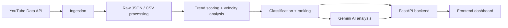

# YouTube Trend Intelligence Platform

A production-oriented trend intelligence system that transforms fast-moving YouTube video data into ranked signals, helping identify what is gaining momentum and why. The project combines ingestion, data processing, trend scoring, ranking, REST API delivery, and optional AI-generated narrative analysis to turn raw platform data into usable intelligence.

## Live Demo

- Production API: https://youtube-trend-intelligence.onrender.com
- Frontend app: https://youtube-trend-intelligence-frontend.onrender.com

## What problem this project solves

YouTube trend data is high-volume, noisy, and constantly changing. Signals are scattered across video metadata, engagement patterns, and velocity indicators. This project addresses that by building a repeatable pipeline that:

- ingests trending video metadata from the YouTube Data API
- normalizes and cleans the raw records
- computes trend relevance and growth indicators
- ranks videos by momentum and engagement quality
- exposes the results through a FastAPI backend
- supports AI-assisted analysis for selected videos

The goal is not simply to display a dashboard, but to surface actionable trend signals that help interpret what is accelerating and why.

## Key capabilities

- YouTube trending data ingestion via the official API
- Data validation and transformation with Pandas
- Trend scoring based on weighted engagement and growth signals
- Velocity-based ranking for fast-growth content
- Category classification using keyword heuristics
- REST API with structured responses for summary, ranking, and analysis data
- Optional AI explainability using Gemini for qualitative trend analysis
- Separate frontend and backend architecture for production deployment

## Architecture

The repository follows a simple layered architecture:

- Ingestion layer: requests trending metadata from YouTube
- Processing layer: cleans and transforms raw JSON into analytic datasets
- Analytics layer: computes trend score, velocity, classification, and status
- API layer: exposes machine-readable endpoints through FastAPI
- AI layer: enriches selected video records with short narrative analysis
- Presentation layer: a Vite frontend consumes the API and renders a dashboard



## Data flow

1. Trending video metadata is fetched from YouTube.
2. Raw payloads are normalized and saved to processed datasets.
3. Cleaning removes incomplete or malformed rows.
4. Trend metrics are calculated using views, likes, comments, and age-adjusted velocity.
5. Videos are classified into categories and status bands such as EXPLODING, GROWING, STABLE, or DECLINING.
6. Data is exposed through API endpoints for summary and ranking views.
7. A selected video can be sent to Gemini for structured AI analysis.

## Trend scoring / intelligence methodology

The project uses a transparent, explainable scoring approach rather than a black-box model.

Core ideas:

- weighted trend score combines reach and engagement signals
- velocity measures views gained over time, adjusted by how recently a video was published
- engagement rate blends likes and comments against view count
- classification adds business-friendly labels to the ranking output
- AI analysis is used as an interpretation layer, not as the primary source of truth

A simplified view of the trend signal logic is:

- trend_score = views * 0.60 + likes * 0.25 + comments * 0.15
- velocity_score = views_per_hour * (1 + engagement_rate)
- trend_strength is derived from the combined signal and normalized for ranking
- trend_status is assigned from thresholds such as EXPLODING, GROWING, STABLE, and DECLINING

This keeps the system interpretable and production-friendly while still providing useful ranking signals.

## API endpoints

The following endpoints are implemented in the current FastAPI application and should be treated as the official API surface.

| Method | Endpoint | Description |
| --- | --- | --- |
| GET | / | API health and metadata |
| GET | /trends | Returns a paged list of trend records |
| GET | /trends/top | Returns the top trend records |
| GET | /trends/summary | Returns summary metrics and category/status counts |
| GET | /trends/emerging | Returns the most promising emerging trends ranked by strength and velocity |
| GET | /trends/{video_id}/analysis | Returns AI analysis for a specific video ID |

### Endpoint details

#### GET /

Returns a basic health message.

Example response:

```json
{
  "message": "YouTube Trend Intelligence API",
  "status": "running"
}
```

#### GET /trends

Returns the first 20 trend records from the processed dataset.

#### GET /trends/top

Returns the first 10 highest-priority records.

#### GET /trends/summary

Returns summary metrics including total videos, top categories, average trend strength, and status counts.

Example response:

```json
{
  "total_videos": 49,
  "top_categories": [
    { "category": "Gaming", "count": 13 },
    { "category": "Movies & Entertainment", "count": 12 },
    { "category": "Other", "count": 12 },
    { "category": "Music", "count": 11 }
  ],
  "average_trend_strength": 14.78,
  "status_counts": {
    "EXPLODING": 1,
    "GROWING": 0,
    "STABLE": 0,
    "DECLINING": 0
  }
}
```

#### GET /trends/emerging

Returns ranked emerging trends sorted by trend strength and velocity.

#### GET /trends/{video_id}/analysis

Returns AI-generated analysis using the supplied metadata for a target video ID.

Example response:

```json
{
  "video_id": "abc123",
  "title": "Example Video Title",
  "analysis": "1. Main Topic\n...\n7. One-Sentence Summary\n..."
}
```

## Example API response

Example response from the live production API:

```json
{
  "total_videos": 49,
  "top_categories": [
    { "category": "Gaming", "count": 13 },
    { "category": "Movies & Entertainment", "count": 12 },
    { "category": "Other", "count": 12 },
    { "category": "Music", "count": 11 }
  ],
  "average_trend_strength": 14.78,
  "status_counts": {
    "EXPLODING": 1,
    "GROWING": 0,
    "STABLE": 0,
    "DECLINING": 0
  }
}
```

## Tech stack

- Python
- FastAPI
- Pandas
- NumPy
- Google Generative AI (Gemini)
- YouTube Data API v3
- Vite + React frontend
- Render deployment
- GitHub for source control

## Project structure

```text
youtube-trend-intelligence/
├── README.md
├── requirements.txt
├── LICENSE
├── .env
├── .env.example
├── config/
├── data/
│   ├── raw/
│   └── processed/
├── frontend/
│   ├── src/
│   ├── package.json
│   └── vite.config.js
├── notebooks/
├── src/
│   ├── ai/
│   ├── analytics/
│   ├── api/
│   ├── ingestion/
│   └── ml/
├── tests/
└── .gitignore
```

## Local development setup

### Prerequisites

- Python 3.10+
- Node.js and npm
- A YouTube Data API key
- A Gemini API key

### Backend setup

```bash
python -m venv .venv
source .venv/bin/activate
pip install -r requirements.txt
```

Create a local environment file with the required values:

```bash
cp .env.example .env
```

Then populate the variables:

```bash
export YOUTUBE_API_KEY="your_youtube_api_key"
export GEMINI_API_KEY="your_gemini_api_key"
```

Run the API locally:

```bash
uvicorn src.api.main:app --reload --host 0.0.0.0 --port 8000
```

### Frontend setup

```bash
cd frontend
npm install
npm run dev
```

The frontend is configured to consume the backend via the API base URL and supports local development with a local backend URL when needed.

## Environment variables

The repository expects environment variables for external services. Do not commit secrets to source control.

Required variables:

- `YOUTUBE_API_KEY` — used by the YouTube ingestion client
- `GEMINI_API_KEY` — used by the AI analysis layer

Optional variables:

- `VITE_API_URL` — for frontend configuration when using a non-default deployment target

Example:

```bash
YOUTUBE_API_KEY=your_youtube_api_key
GEMINI_API_KEY=your_gemini_api_key
VITE_API_URL=https://youtube-trend-intelligence.onrender.com
```

## Production deployment

This project is deployed in production as a separated backend/frontend architecture:

- FastAPI backend: https://youtube-trend-intelligence.onrender.com
- Frontend app: https://youtube-trend-intelligence-frontend.onrender.com

The backend is a hosted REST API that serves processed trend data and AI analysis endpoints. The frontend is a separate Vite application that consumes the API and renders the dashboard experience.

## Testing / validation

The repository includes automated tests for the API behavior and trend logic. Validation focuses on:

- summary endpoint correctness
- emerging trend rank ordering
- empty-dataset behavior
- missing-data failure paths

Example command:

```bash
pytest
```

The FastAPI app is also validated through the API test suite using TestClient, which checks endpoint responses without requiring external API credentials.

## Engineering decisions

- A lightweight pandas-based pipeline keeps the project easy to reason about and debug.
- The API remains a thin read layer over processed CSV datasets.
- Explicit threshold rules make trend status classification understandable and auditable.
- AI analysis is treated as an interpretation layer, not as the core ranking mechanism.
- Frontend and backend are separated to support independent deployment and clean production boundaries.
- Configuration relies on environment variables rather than hardcoded secrets.

## Limitations

- Trend classification is rule-based rather than model-trained.
- The system depends on the quality and availability of the YouTube Data API.
- AI analysis is optional and may be unavailable when Gemini credentials or provider access are not configured.
- The processed data is static at the time of each pipeline run rather than a continuously refreshed live stream.
- Category inference is heuristic and may not perfectly reflect all video content.

## Future improvements

- Scheduled ingestion jobs for regular refreshes
- Persistent database storage instead of CSV-only persistence
- Real-time or near-real-time trend updates
- More sophisticated ranking models and evaluation metrics
- User authentication and access control
- Dashboard analytics, filtering, and historical views
- Improved observability, monitoring, and error alerting

## License

This project is licensed under the MIT License. See [LICENSE](LICENSE) for details.
